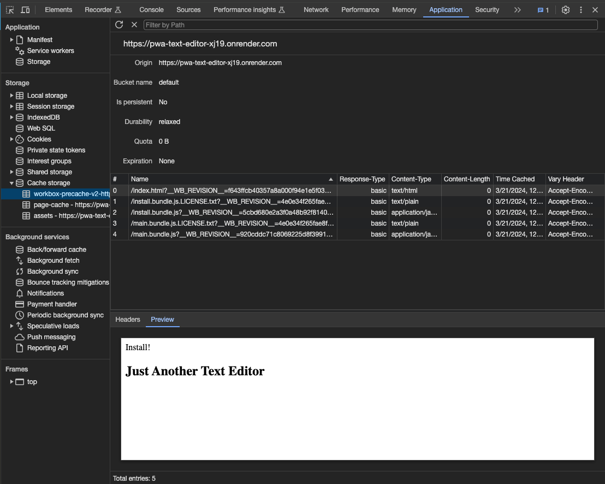

# Just Another Text Editor PWA 

## Description 

This single-page application is a text-editor that follows PWA criteria and allows a user to reliably write and save notes.  

[PWAs](https://web.dev/explore/progressive-web-apps), or Progressive Web Applications, are programs that use web technologies to build fast and flexible web applications so that they perform like a native app. 

This application utilizes the `IndexedDB` database for retrieving and storing data so that any written note is automatically saved and persists when the window is refreshed or reopened. This tool also implements a number of [Workbox](https://web.dev/learn/pwa/workbox) features and plugins including `InjectManifest` to inject a custom service worker for allowing offline functionality, and caching methods for storing and serving static assets.

## Table of Contents 
- [Installation](#installation)
- [Dependencies](#dependencies)
- [Usage](#usage)
- [Contributing](#contributing)
- [License](#license)
- [Questions](#questions)
  
## Installation 
There is no installation necessary for this application as it is deployed using [Render](https://docs.render.com/). You can access and use the application [here](https://pwa-text-editor-xj19.onrender.com/) or at the following link: https://pwa-text-editor-xj19.onrender.com/

If you are interested in running the application locally, please use the following steps:
1. Clone this repository to your local machine. (For reference, visit the [Cloning a Repository](https://docs.github.com/en/repositories/creating-and-managing-repositories/cloning-a-repository) GitHub Docs article.)
2. Run `npm install && npm run build` in your CLI to download the npm package dependencies.
3. Run `npm run start` to start up the backend and serve the client.
4. Navigate to `http://localhost:3000` on your local web browser to use the application. 
  
## Dependencies
This project requires the following npm package dependencies, which are included in `client/package.json`:  

## Usage 

### Getting Started
Upon accessing the [text editor](https://pwa-text-editor-xj19.onrender.com/), `IndexedDB` will immediately create a database storage and the user will be presented with the main page, depicted below.  

When navigating to Chrome DevTools, you'll see the app details for the registered service worker, manfifest file, and pre-cached static assets. 

### Updating Content
After writing some content and clicking off of the DOM window, the new content is updated in the database storage. You will find that the content data persists after closing and reopening the application by re-rendering the value saved in `IndexedDB`.  

### Installing a Desktop Shortcut
As a PWA, this text editor supports installation so that it can be saved to your local desktop. By pressing the Install button, J.A.T.E. will be downloaded as a Chrome App and can be accessed directly as a desktop shortcut. 

## Contributing
To make contributions to this project:  
1. Fork the repository  
2. Make some commits to improve the application
3. Open a Pull Request on GitHub
4. From there, we can discuss your changes and merge the pull request once your contributions have been approved!

## License 
This GitHub repository is licensed under the MIT license. Please refer to the license documentation [here](https://opensource.org/licenses/MIT).
  
## Questions
This project was developed by [dymoy](https://github.com/dymoy).  
For any related questions, please contact me via email at <derekymoy@gmail.com>.
